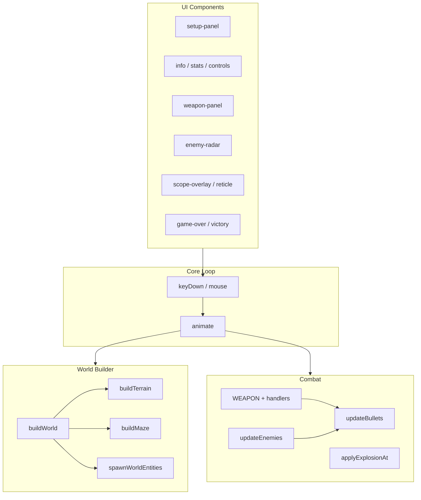

# Документация 3D Арена

Руководство по **логическим компонентам** игры. Исходный код — один файл [`web/index.html`](../web/index.html); здесь компонент = связанная группа DOM-элементов, констант и функций.

## Оглавление

| Документ | Содержание |
|----------|------------|
| [architecture.md](architecture.md) | Архитектура, цикл кадра, карта модулей, зависимости |
| [ui-components.md](ui-components.md) | HUD, прицел, панель оружия, настройки, game over / victory |
| [weapons.md](weapons.md) | Пять видов оружия, режим G, обработчики мыши |
| [game-systems.md](game-systems.md) | Игрок, коллизии, пули, LOS, урон, импульс, взрывы |
| [world-and-entities.md](world-and-entities.md) | Рельеф, ямы, укрытия, лабиринт, враги, боссы |
| [configuration.md](configuration.md) | `arenaSettings`, пресеты, UI настроек |

## Карта компонентов (верхний уровень)

## Ключевые глобальные объекты

| Имя | Тип | Назначение |
|-----|-----|------------|
| `scene`, `camera`, `renderer` | Three.js | Рендер |
| `arenaSettings` | `object` | Параметры арены из UI |
| `terrain`, `covers`, `mazeMeshes` | `Mesh[]` | Геометрия мира |
| `enemies`, `shootables` | `Object3D[]` | Цели |
| `bullets`, `enemyBullets` | `Mesh[]` | Снаряды |
| `currentWeapon` | `number` | Активный слот `WEAPON.*` |
| `rangedMode` | `boolean` | Режим дальнего боя (G) |
| `gameActive` | `boolean` | Идёт ли матч |

## С чего начать правку

| Задача | Файл | Модуль / функции |
|--------|------|------------------|
| Новое оружие | `index.html` | `WEAPON`, `WEAPON_INFO`, `handlePrimaryClick`, `handleSecondaryDown` |
| Новый враг | `index.html` | `spawnEnemy`, `updateEnemies`, `createEnemyVisual` |
| Параметр арены | `index.html` | `arenaSettings`, setup-panel inputs, `readArenaSettingsFromUI` |
| Новый HUD-элемент | `index.html` | HTML в `<body>`, стили в `<style>`, привязка в `animate` |
| Коллизия пуль | `index.html` | `isBulletPathBlocked`, `getBulletBlockers` |

## Соглашения в коде

- **Координаты:** X/Z — плоскость арены, Y — высота; игрок смотрит по углу `rotate`.
- **Временные векторы:** `tmpVec`, `tmpVec2`, `tmpVec3` — не хранить ссылки между кадрами.
- **userData целей:** `shootable`, `health`, `maxHealth`, `enemy`, `dangerous`, `isBoss`.
- **userData лабиринта:** `mazePiece` с полями `blocksBullets`, `blocksMovement`, `jumpable`.

См. также [README в корне](../README.md).
