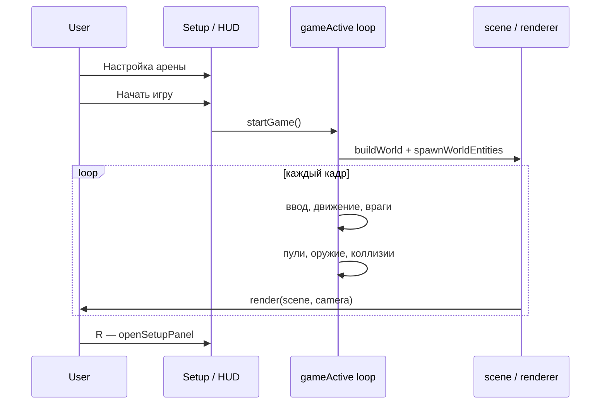
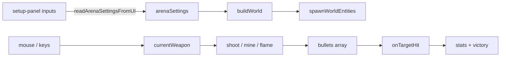

# Архитектура

## Обзор

Приложение — **single-page** без сборщика: HTML, CSS и ES-модуль Three.js в `web/index.html`. Точка входа — загрузка модуля Three.js, инициализация сцены и вызов `animate()`.

## Жизненный цикл игры

| Состояние | Флаг / UI | Как попасть |
|-----------|-----------|-------------|
| Настройка | `gameActive === false`, `#setup-panel` виден | Старт страницы, `R` |
| Матч | `gameActive === true` | `#btn-start-game` |
| Поражение | `#game-over.visible` | `lives <= 0` → `endGame()` |
| Победа | `#victory.visible` | `checkVictory()` |

**Старт матча:** `startGame()` — читает UI, `buildWorld()`, сбрасывает статистику, `setWeapon(STANDARD)`, скрывает setup.

**Рестарт:** `openSetupPanel()` — останавливает бой, `clearCombatState()`, показывает настройки.

## Главный цикл `animate()`

Порядок внутри `if (gameActive)` (упрощённо):

1. `updateEnemyRadar()`
2. Движение игрока **или** `updateRangedAimCamera()` (режим G)
3. Гравитация, приземление, ямы → `recoverPlayerFromVoid`
4. `updateEnemies`, `updateMines`, `checkEnemyContact`
5. Вне боя: интерполяция `camera.fov` → `targetFov`
6. `applyCameraLook()`
7. `updateBullets` (игрок и враг)
8. `updateImpulseWaves`, `updateFlamethrower`, `updateRockets`, взрывы
9. `renderer.render(scene, camera)`

## Загрузка Three.js

Скрипт пробует CDN, при ошибке — `./vendor/three.module.js`. Сообщение об ошибке показывается в DOM, если модуль не загрузился.

## Карта логических модулей

Блоки в `web/index.html` (приблизительные номера строк могут сдвигаться):

| Модуль | Ответственность | Ключевые символы |
|--------|----------------|------------------|
| **Arena config** | Размеры, пресеты | `WORLD`, `arenaSettings`, `DIFFICULTY_PRESETS` |
| **World build** | Меши арены | `buildWorld`, `buildTerrain`, `buildMaze`, `buildCovers` |
| **Maze logic** | Сетка, коллизии, крыши | `mazePieces`, `resolveMazeCollision`, `getMazeLosMeshes` |
| **Player** | Позиция, прыжок, спавн | `position`, `playerY`, `relocatePlayerToSpawn` |
| **Input** | Клавиши, мышь | `keys`, `keyDown`, `mousedown` |
| **Camera / aim** | Вид, дальний бой | `applyCameraLook`, `rangedMode`, `getRangedAimDirection` |
| **Weapons** | Слоты 1–5 | `WEAPON`, `handlePrimaryClick`, `fireImpulse`, … |
| **Projectiles** | Пули и проверки | `updateBullets`, `isBulletPathBlocked` |
| **Enemies** | AI, стрельба | `updateEnemies`, `enemyShoot` |
| **Damage** | HP игрока и целей | `damagePlayer`, `onTargetHit` |
| **UI sync** | Текст HUD | `updateStatsUI`, `updateWeaponUI` |

## Потоки данных

## Расширение без распила файла

1. Добавьте константы рядом с родственными (`WEAPON`, `FLAME_*`).
2. Зарегистрируйте обработчик в `handlePrimaryClick` / `handleSecondaryDown`.
3. Добавьте шаг в `animate()` только при необходимости кадровой логики.
4. Обновите `WEAPON_INFO` и HTML-слот в `#weapon-slots`.
5. Отразите изменение в `docs/weapons.md`.

## Зависимости между модулями

- **Оружие** зависит от **камеры/прицела** (`getShootDirectionFromMouse`, `getRangedAimDirection`).
- **Пули** зависят от **мира** (`getBulletBlockers`, `getTerrainHeight`).
- **Враги** зависят от **коллизий** (`resolveMazeCollision`, `placeEnemyAt`).
- **Взрывы** зависят от **LOS** (`isExplosionBlockedToTarget`, `isUnderMazeRoof`).

Избегайте циклических вызовов: `applyCameraLook` → raycast → снова `applyCameraLook` без необходимости; для raycast используйте `syncCameraForRaycast`.
