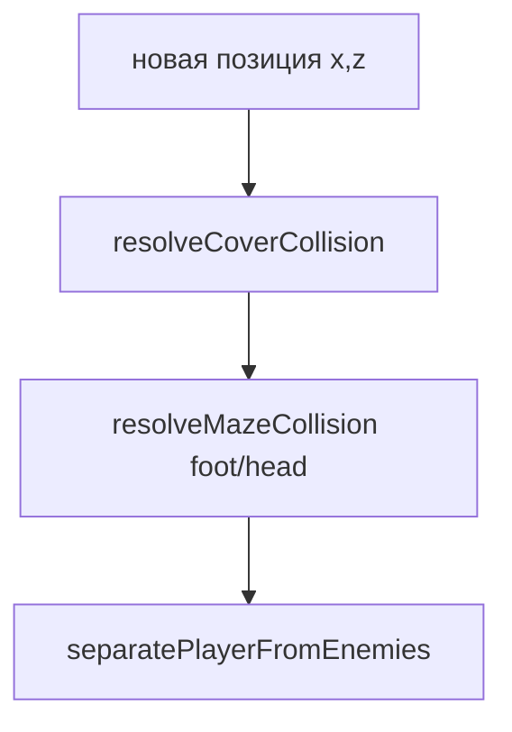

# Игровые системы

## Компонент: игрок

| Переменная | Описание |
|------------|----------|
| `position.x/z` | Положение на плоскости |
| `playerY` | Высота «глаз» (`WORLD.eyeOffset` над опорой) |
| `rotate` | Горизонтальный угол взгляда (радианы) |
| `velocityY` | Вертикальная скорость |
| `onGround` | Стоит ли на поверхности |

**Опора и приземление:**

- `getFootY()` — уровень ног
- `getSupportYAt(x, z, ref)` — пол: террейн, лабиринт, верх плит
- `sweepMazeLanding` — задевание платформ при падении
- `recoverPlayerFromVoid` — вытаскивание из ямы без урона

**Урон игроку:** `damagePlayer(reason, details)` — лог `[HP]`, неуязвимость `invincibleUntil`, `spawnSafeUntil`.

## Компонент: ввод

```javascript
const keys = { w, a, s, d, strafeLeft, strafeRight };
```

| Событие | Действие |
|---------|----------|
| `keydown` / `keyup` | Движение, прыжок, G, смена оружия |
| `resetMovementKeys()` | blur, visibility, game over, победа; `pressedMovementCodes` + `keyup` |

Стрейф: `Q` / `E` или стрелки ← →.

| `V` | Вид сзади (`thirdPersonView`) — меш игрока, камера сзади; колесо — дистанция 2.4–10.5 м |
| `G` | Дальний прицел; при включении принудительно **первое лицо** |

## Компонент: коллизии



| Функция | Объекты |
|---------|---------|
| `resolveCoverCollision` | `covers[]` (AABB) |
| `resolveMazeCollision` | `mazePieces` — стены по высоте ног/головы |
| `separatePlayerFromEnemies` | отталкивание от врагов в упор |

**Прыжок:** `canPlayerJump()` — опора под ногами, не в режиме G.

## Компонент: пули

Два массива: `bullets` (игрок), `enemyBullets` (враги).

**Обновление:** `updateBullets(list, delta, isPlayer)`.

### Блокировка траектории

`isBulletPathBlocked(prev, next)`:

- Разбиение пути на шаги `BULLET_PATH_STEP` (~0.22 м)
- Raycast по `getBulletBlockers()` — террейн, укрытия, лабиринт
- Проверка высоты: `getTerrainHeight` + `BULLET_TERRAIN_CLEARANCE`

### Пули игрока

- Столкновение с `shootables` и блокерами
- `canDamageEnemyAt` — опасные/боссы только в `enemyDamageRadius`
- `getShootableRoot` — подъём до корня цели

### Пули врага

- Перед выстрелом: `lineOfSight(from, player)` в `enemyShoot`
- Попадание: `isEnemyBulletHittingPlayer` + LOS от пули до игрока
- Не наносят урон сквозь укрытие: `playerBehindCover` (только `covers`; LOS для рельефа — в path block)

## Компонент: линия видимости (LOS)

`lineOfSight(from, to, margin)` — raycast по `losBlockers()`:

`terrain`, `covers`, `getMazeLosMeshes()`.

Используется: взрывы, пули врага, огнемёт, импульс (косвенно).

## Компонент: урон по целям

`onTargetHit(target, damage, hitPoint)`:

1. Проверка `shootable`, LOS для боссов/опасных
2. Уменьшение `health`, вспышка emissive
3. Масштаб HP (`scale` или `bossBody`)
4. Уничтожение → `removeShootable`, `checkVictory`

**Взрывы:** `applyExplosionAt(x, z, radius, maxDamage, opts)` — затухание по дистанции, цепные мины, `explosionY` для ракет.

## Компонент: импульс

- `fireImpulse()` → `spawnImpulseWave`, цикл по `enemies`
- `isInImpulseRange`, `getImpulseDamage`, knockback + `stunnedUntil`
- `capEnemyKnockback`, `separatePlayerFromEnemies` после импульса

## Компонент: контакт с врагом

`checkEnemyContact()` — раз в ~900 ms, горизонталь + вертикаль ≤ 0.95 m, урон `contactDamage`.

## Отладка

В консоли браузера при уроне игроку:

```text
[HP] { reason, livesBefore, pos, weapon, ... }
```

Причины: `пуля_врага`, `контакт_врага`, `взрыв`, `провал`, и т.д.

## Баллы и победы

| Показатель | Правило |
|------------|---------|
| Баллы забега | `stats.points` — +1 за каждую единицу HP, снятую у врага, босса или статичной мишени (`onTargetHit` → `addMatchScore`) |
| Победа | `checkVictory()` — все опасные враги и боссы уничтожены |
| Запись победы | `recordVictory(stats.points)` — `wins++`, `totalPoints += забег`, обновление `bestRunPoints` / `lastWinPoints` |
| Хранение | `localStorage`, ключ `three-app-arena-record` |

Укрытия и деревья в баллы не входят (не shootable).

## Чеклист изменения боевой механики

- [ ] Обновлены blockers / LOS meshes?
- [ ] Путь пули: `isBulletPathBlocked` и субшаги
- [ ] Урон цели: `onTargetHit` / `canDamageEnemyAt`
- [ ] Статистика: `stats.shots` / `hits` / `destroyed` / `points`
- [ ] Победы: `recordVictory` → `localStorage` (`three-app-arena-record`)
- [ ] Документация: `weapons.md` или этот файл
