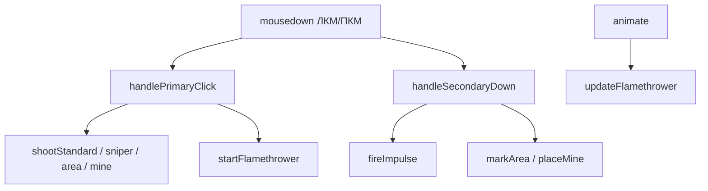

# Оружие и бой

## Реестр оружия

Константа `WEAPON` и метаданные `WEAPON_INFO`:

```javascript
const WEAPON = { STANDARD: 1, SNIPER: 2, AREA: 3, MINE: 4, FLAMETHROWER: 5, LASER: 6 };
```

| ID | Ключ | Слот | ЛКМ | ПКМ |
|----|------|------|-----|-----|
| 1 | `STANDARD` | ① | `shootStandard` | `fireImpulse` |
| 2 | `SNIPER` | ② | `shootSniper` | — |
| 3 | `AREA` | ③ | `fireAreaStrike` | `markArea` |
| 4 | `MINE` | ④ | `detonateMineClick` | `placeMine` |
| 5 | `FLAMETHROWER` | ⑤ | удержание `ЛКМ` | — |
| 6 | `LASER` | ⑥ | `startLaserCharge` → луч | — |

Переключение: `setWeapon(id)`, клавиши `1`–`6`, `B` → `cycleWeapon()`.

## Режим «Оружие на поле»

Чекбокс `inp-weapons-on-field` → `arenaSettings.weaponsOnField`.

| Режим | Поведение |
|-------|-----------|
| Выключен (по умолчанию) | Все слоты ①–⑤ доступны сразу |
| Включен | Старт только с ①; ②–⑥ — пикапы на карте (`weaponPickups`) |

**Состояние:** `weaponUnlocks` (`Set`), сброс в `resetWeaponProgress()` при старте и в меню.

**Пикапы:** `spawnWeaponPickups()` после `spawnWorldEntities()`; сбор в `updateWeaponPickups(time)` при дистанции ≈ 1.75 м. Заблокированные слоты в HUD помечены 🔒; `setWeapon` / `cycleWeapon` / клавиши `2`–`5` работают только для разблокированного оружия.

## Точки входа (компонент Weapons)



| Функция | Когда вызывается |
|---------|------------------|
| `handlePrimaryClick(event)` | Клик ЛКМ (кроме огнемёта) |
| `handleSecondaryDown(event)` | ПКМ |
| `startFlamethrower` / `stopFlamethrower` | ЛКМ вниз/вверх для слота 5 |
| `updateFlamethrower(delta, time)` | Каждый кадр при удержании |

## Режим дальнего боя (G)

**Состояние:** `rangedMode`, углы `rangedCamPitch`, `rangedCamYaw`, FOV `rangedFov`.

| Действие | Поведение |
|----------|-----------|
| `G` | `toggleRangedMode()` |
| `W` / `S` | Наклон прицела вверх / вниз |
| `A` / `D` | Поворот прицела влево / вправо |
| Колесо | Изменение `rangedFov` (8°–45°) |
| Мышь | Прицел (`#scope-reticle`) и луч попадания следуют за курсором |

**Направление выстрела в режиме G:** `getRangedAimDirection()` — raycast из камеры через `aimMouse` по целям и рельефу.

**Ограничения в режиме G:**

- Нет ходьбы (WASD не двигают `position`)
- Нет прыжка (`canPlayerJump` → false)
- Обычный `#crosshair` скрыт

**Камера:** `applyCameraLook()` → `lookAt(getRangedLookTarget())`.

## ① Стандарт

- Пуля: `bullets`, скорость `BULLET_SPEED`, урон 1.
- ПКМ: `fireImpulse()` — волна, отброс и урон в радиусе `IMPULSE_RADIUS`.
- Игнор коллизий у дула: `blockIgnoreUntil` на 80 ms.

## ② Винтовка

- Кулдаун `SNIPER_COOLDOWN`, скорость `SNIPER_SPEED`, время полёта `SNIPER_LIFE`, урон `SNIPER_DAMAGE`.
- Попадание: `resolvePlayerBulletHit` по отрезку кадра + `SNIPER_SEGMENT_PAD` / `SNIPER_HIT_RADIUS_MUL`, флаг `bullet.userData.sniper`.
- Медленнее движение вне режима G: `SNIPER_MOVE_MULT`.

## ③ Ракетница

1. ПКМ: `markArea` → `raycastMarkPoint` → `areaTarget` + кольцо `#areaMarker`.
2. ЛКМ: `fireAreaStrike` — спавн ракеты, падение, `spawnAreaExplosion`.
3. Урон с учётом укрытий: `isUnderMazeRoof`, `isExplosionBlockedToTarget`.

## ④ Мины

- Массив `mines[]`: `{ mesh, x, z, y, dead, phase }`.
- ПКМ: `placeMine` — лимит `MINE_MAX_COUNT`, кулдаун `MINE_PLACE_COOLDOWN`.
- ЛКМ: `detonateMineClick` — raycast по мине или ближайшая в радиусе.
- Проксимити: `updateMines` → `detonateMineAt` у врагов.
- Взрыв: `applyExplosionAt` с `chainMines: true`.

## ⑤ Огнемёт

Константы: `FLAME_RANGE`, `FLAME_TICK`, `FLAME_DAMAGE`, `FLAME_MIN_DOT`.

| Функция | Роль |
|---------|------|
| `applyFlameDamage()` | Конус + LOS, `onTargetHit` каждые ~0.11 с |
| `updateFlameVisual(time)` | `flameStream` — узкая струя сегментов от `getFlameMuzzleWorld` (~`FLAME_VISUAL_RANGE`) |
| `getFlameAimDirection()` | Луч: в G — `getRangedAimDirection`, иначе raycast по мыши |

## ⑥ Лазер

- ЛКМ: `startLaserCharge` → `updateLaserCharge` (~`LASER_CHARGE_TIME` с) → `fireLaserBeam`.
- Визуал зарядки: `laserChargeVisual` (сфера + кольца у дула).
- Выстрел: hitscan-луч на `LASER_MAX_RANGE`, длина до первой стены/укрытия (`computeLaserBeamLength`, AABB лабиринта).
- Урон всем врагам на линии до преграды; луч `spawnLaserBeamVisual`, затухание `updateLaserBeams`.
- Кулдаун `LASER_COOLDOWN`; в G прицеливание как у остального оружия.

## Связанные системы

- Попадания: [game-systems.md](game-systems.md) → `onTargetHit`, `updateBullets`
- Прицел: [ui-components.md](ui-components.md) → scope / crosshair
- Настройки урона: [configuration.md](configuration.md) → радиусы в `arenaSettings`
